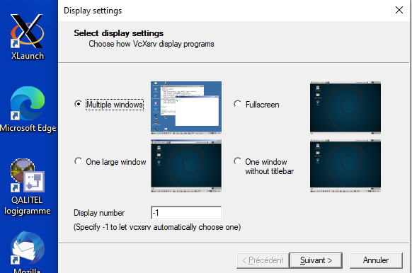
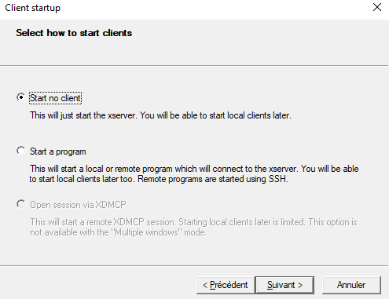
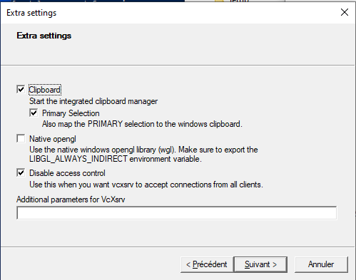
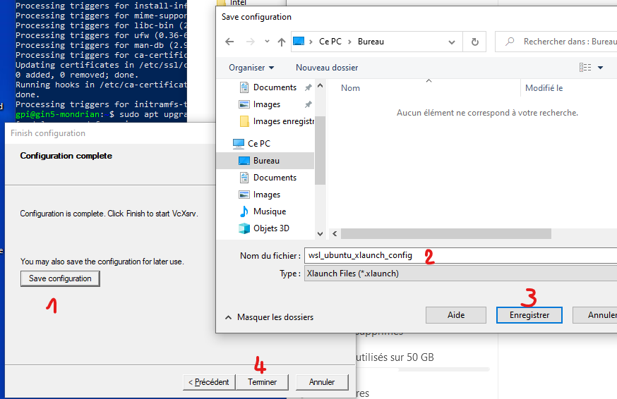

Linux
=====
With Linux, Singularity seems to work perfectly well. Given the characteristics of the 2 proposed technologies ([container or virtual machine](https://www.geeksforgeeks.org/difference-between-virtual-machines-and-containers/)) it is clear that it is better to use a container for performance reasons.
In the following we propose exclusively for linux the use of a Singularity container.

**Short**:  
  *Read-only container*:
  - "Two softwares must be installed: Python (version >= 3.7) and Singularity (version > 3.6)"
  - mkdir -p $HOME/casa_distro/brainvisa-opensource-master # create an installation directory
  - "[download the last casa-dev image](https://brainvisa.info/download/) (ex. casa-dev-5.0-1.sif), preferably into the $HOME/casa_distro directory"
  - singularity run -B $HOME/casa_distro/brainvisa-opensource-master:/casa/setup $HOME/casa_distro/casa-dev-5.0-1.sif branch=master distro=opensource # execute the container image using Singularity
  - "set the bin/ directory of the installation directory in the PATH environment variable of the host system, typically add `export PATH="$HOME/casa_distro/brainvisa-opensource-master/bin:$PATH"` in $HOME/.bashrc if unix bash shell
  - "add `cmake_options += -DPYTHON_EXECUTABLE=/usr/bin/python3` in the [ build $CASA_BUILD ] section of the $HOME/casa_distro/brainvisa-opensource-master/conf/bv_maker.cfg file (host) to make python3 as default"
  - bv_maker #  to build from within container terminal or from outside the container
  - bv # to run the configuration GUI
  - bv bash # to open a terminal in the container

  *To create a container within a writable directory*:
  - sudo singularity build --sandbox $HOME/casa_distro/casa-dev-5.0-1_wr $HOME/casa_distro/casa-dev-5.0-1.sif # to make an editable image (casa-dev-5.0-1_wr)
  - sudo singularity run --writable $HOME/casa_distro/casa-dev-5.0-1_wr bash # to modify the image
  - "It is now possible to modify the image. For example let's update all packages and install emacs:"
  - Singularity> apt update  # Singularity> is the prompt
  - Singularity> apt-get install -y software-properties-common
  - Singularity> add-apt-repository ppa:kelleyk/emacs
  - Singularity> apt install emacs26
  - "Edit the $HOME/casa_distro/brainvisa-opensource-master/conf/casa_distro.json file and change the value of the `image` key (ex. "image": "/home/econdami/casa_distro/casa-dev-5.0-1_wr" in place of "image": "/home/econdami/casa_distro/casa-dev-5.0-1.sif")"
  - "Then using `bv` or `bv bash` will use the casa-dev-5.0-1_wr image" 

**[Longer](https://brainvisa.info/web/download.html)**


MacOS (SingularityCE Vagrant Box)
===================================

Under MacOS High Sierra (10.13.6), Singularity Vagrant Box seems to work well enough, better than VirtualBox alone.

A - Install a Vagrant provider like VirtualBox (if not already installed):

	1 - Download VirtualBox OSX dmg file [here](https://www.virtualbox.org/wiki/Downloads)
	2 - Open it and Install it 
	3 - Maybe you'll need to allow this Oracle application in Preferences Panel then Security icon

B - Install Homebrew (if not already installed):

	1 - In a Terminal (in Applications/Utilities) enter:
	2 - ruby -e "$(curl -fsSL https://raw.githubusercontent.com/Homebrew/install/master/install)"

C - Install Vagrant:

	1 - brew tap hashicorp/tap
	2 - brew install vagrant

D - Install Xquartz:

	1 - go to https://www.xquartz.org and download XQuartz-2.8.1.dmg
	2 - Install it
	3 - sudo nano /etc/ssh/ssh_config
	4 - Add 'ForwardX11 yes' in Host * section
	5 - Exit Terminal 
	6 - Reboot the system to take effect. 

E - Install SingularityCE Vagrant Box:

	1 - mkdir vm-singularity && cd vm-singularity
	2 - export VM=sylabs/singularity-ce-3.8-ubuntu-bionic64 && vagrant init $VM 
	3 - vagrant up && vagrant ssh
	3 - This launch the Ubuntu Singularity virtual machine, 
		the 'vagrant@vagrant' prompt appears and XQuartz is launched

F - Install Brainvisa

	1 - the '>' before command indicate to enter it in vagrant@vagrant> prompt
	2 - >mkdir casa-dev-5.0.4 && cd casa-dev-5.0.4
	3 - >wget https://brainvisa.info/download/casa-dev-5.0-4.sif
	4 - >singularity run -B .:/casa/setup casa-dev-5.0-4.sif branch=master distro=opensource
	5 - >nano conf/bv_maker.cfg
	6 - in the [ build $CASA_BUILD ] section add:
		cmake_options += -DPYTHON_EXECUTABLE=/usr/bin/python3 
	7 - >echo 'export PATH=${PATH}:${HOME}/casa-dev-5.0.4/bin' >> ~/.bashrc
	8 - >source ~/.bashrc
	9 - >bv_maker #(this step takes a long time 30mn to 2h)

G - Install Populse-mia

	1 - >bv bash 
	2 - the 'opensource-master' prompt appears represented here by >>
	3 - >>cd
	4 - >>mkdir Mia && cd Mia
	5 - >>git clone https://github.com/populse/populse_mia.git
	6 - >>git clone https://github.com/populse/mia_processes.git
	7 - >>git clone https://github.com/populse/mri_conv
	8 - >>python populse_mia/python/populse_mia/main.py

Windows
=======
Here you find documentation to install Populse_MIA in Windows 10.  
We use virtualization with Singularity.  

Before everything, we need to have WSL (Windows Subsystem Linux). With this we can install a linux Ubuntu 20.04 or 18.04.  


### 1 - WSL2 (Windows Subsystem Linux) installation

   - In an administrator type Windows account:  
      - Windows 10 must be up to date
      - You need to have enough free space on your system disk : around 20 Gb
      - Open a **PowerShell as administrator** (right clic on powershell icon):  
      - enter `wsl --install -d Ubuntu-20.04` 
      -   

   - Reboot the computer	
   - Normaly a linux ubuntu window is already available, enter it:  
      - enter a user / password who will be administrator of this linux (asked by the system)
      - 
      - then you can write your first commands to make ubuntu up to date:  
```bash
      sudo apt update
      #at this first sudo command, the system may ask you to enter the password you just enter before.
      sudo apt upgrade -y
      exit
```
   - close this window

Now you have WSL2 and an Ubuntu 20.04 linux.   
Before you install a new distribution using `wsl --install -d distribution`, make sure that WSL is in 2 mode with:  
   `wsl --set-default-version 2`  
The distribution is only available for the current Windows user.  
Usefull : in the Ubuntu WSL Windows terminal, we can access Windows files via `/mnt/c/`  

To know more:  
   - [Manual installation steps for older versions of WSL](https://docs.microsoft.com/en-us/windows/wsl/install-manual)
   - [Install WSL](https://docs.microsoft.com/en-us/windows/wsl/install)
   - [Basic commands for WSL](https://docs.microsoft.com/en-us/windows/wsl/basic-commands)  


### 2 - X server installation in windows with VcXsrv 

We also need a X windows server to allow linux applications graphic user interface (GUI) works.  

- Get [VcXsrv](https://sourceforge.net/projects/vcxsrv/files/latest/download)  
  - Execute it, 
  - click 'next' then 'install' to install it 

- Looking for XLaunch application icon, launch it  

- Configure it like the screenshots below:
   - 
   -   
   - Disable *'Native opengl'*
   - Enable *'Disable access control'*
   - 
   - Do *'Save Configuration'* in a file that allow you to launch it later (ie on the Desktop)  
   - 

- Allow access asked by Windows firewall  
  
  
### 3 - Dependencies Installation 

- Open an Ubuntu session in Windows by: 
   - click on Ubuntu new icon  
  or 
   - open a normal Windows PowerShell,  
  enter `ubuntu.20.04.exe`

- In this Ubuntu window terminal, install the following dependencies:  

```bash
   sudo apt install -y build-essential uuid-dev libgpgme-dev squashfs-tools libseccomp-dev wget pkg-config git git-lfs cryptsetup-bin python3-distutils python3-dev 
   # Ubuntu 20.04
   sudo apt install python-is-python3
   # Ubuntu 18.04
   sudo ln -s python3 /usr/bin/python
```


### 4 - Singularity Installation 

On ubuntu, at this time (27-08-2021) there is no package for singularity  
Then to allow [singularity installation](https://singularity.hpcng.org/admin-docs/3.8/) we need go language and some dependances for compilation.  
If you anticipate needing to remove Singularity, it might be easier to install it in a custom directory using the --prefix option to mconfig. In that case Singularity can be uninstalled simply by deleting the parent directory.  
```bash
#Ubuntu 20.04
	sudo apt install -y golang 

#Ubuntu 18.04, singularity need golang version >= 1.13 wich is not available on ubuntu 18.04 (1.10 only)		
	cd /tmp &&\
	wget https://golang.org/dl/go1.17.linux-amd64.tar.gz &&\
	tar -xzf go1.17.linux-amd64.tar.gz &&\
	sudo chown -R root:root go &&\
	sudo mv go /usr/local/ &&\
	rm go1.17.linux-amd64.tar.gz 
 
echo 'export GOPATH=${HOME}/go' >> ~/.bashrc &&\
echo 'export PATH=/usr/local/go/bin:${PATH}:${GOPATH}/bin' >> ~/.bashrc  &&\
source ~/.bashrc
```

Get singularity :

```bash
export VERSION=3.8.0 && # adjust this as necessary \
	wget https://github.com/sylabs/singularity/releases/download/v${VERSION}/singularity-ce-${VERSION}.tar.gz && \
	tar -xzf singularity-ce-${VERSION}.tar.gz && \
	cd singularity-ce-${VERSION}
sudo mkdir /opt/singularity
./mconfig --prefix=/opt/singularity
cd builddir
make
sudo make install
```

Test it with :  
```bash
/opt/singularity/bin/singularity version
```
Then remove installation files:  
```bash
cd ../.. &&\  
rm -R singularity-ce-${VERSION}*
```


### 5 - Populse_MIA with BrainVisa Singularity image installation

In the aim to install Populse_MIA with anatomist viewer, we need the Brainvisa dev singularity image compatible with python 3, QT5
 
- #### 5 - 1 - Brainvisa Installation
```bash
mkdir ~/brainvisa_dev_5.0.4
cd ~/brainvisa_dev_5.0.4
wget https://brainvisa.info/download/casa-dev-5.0-4.sif
mkdir brainvisa_ro
echo	'export PATH=${PATH}:/opt/singularity/bin/:${HOME}/brainvisa_dev_5.0.4/brainvisa_ro/bin' >> ~/.bashrc &&\
source ~/.bashrc
singularity run -B brainvisa_ro:/casa/setup casa-dev-5.0-4.sif branch=master distro=opensource

# we get the ip address to allow X server access and this ip can change when Windows reboot
nano ~/.bashrc
	export DISPLAY=$(cat /etc/resolv.conf | grep nameserver | awk '{print $2 ":0.0"}')
source ~/.bashrc

nano brainvisa_ro/conf/bv_maker.cfg
  [ build $CASA_BUILD ]
     cmake_options += -DPYTHON_EXECUTABLE=/usr/bin/python3
     cmake_options += -DDESIRED_QT_VERSION=5

bv_maker 
# it takes time to compile
```

- #### 5 - 2 - Populse_MIA Installation
```bash
### require for mri_conv ###
sudo apt install -y openjdk-17-jre-headless

mkdir ~/DEV &&\
mkdir ~/DEV/populse_dev &&\
cd ~/DEV/populse_dev
git-lfs clone https://github.com/populse/populse_mia.git #git-lfs allow icons and other ressources to be download
git clone https://github.com/populse/mia_processes
git clone https://github.com/populse/mri_conv

bv python populse_mia/python/populse_mia/main.py
```

