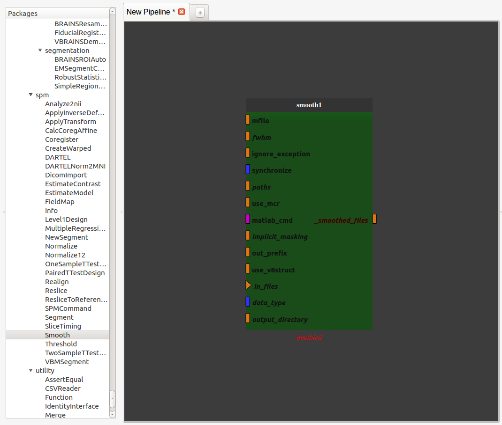
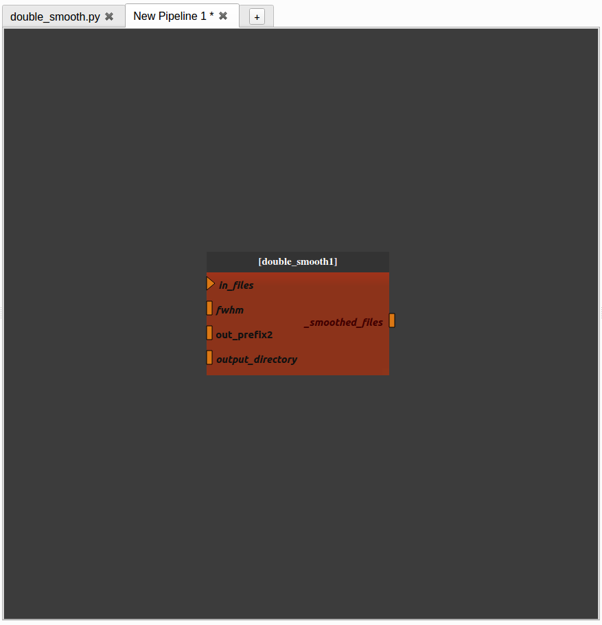
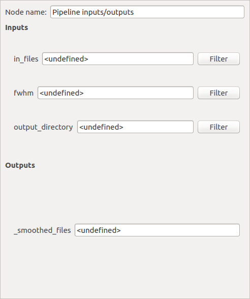
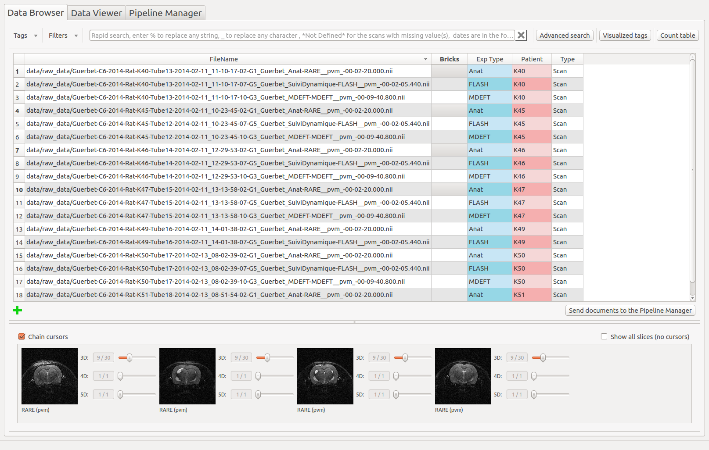

.. :orphan: is used below to try to remove the following warning: checking consistency... /home/econdami/Git_Projects/populse_mia/docs/source/documentation/pipeline_manager.rst: WARNING: document isn't included in any toctree

:orphan:

.. toctree::

+-----------------------+---------------------------------------+---------------------------------------------------+--------------------------------------------------+
|`Home <../index.html>`_|`Documentation <./documentation.html>`_|`Installation <../installation/installation.html>`_|`GitHub <https://github.com/populse/populse_mia>`_|
+-----------------------+---------------------------------------+---------------------------------------------------+--------------------------------------------------+

Populse_MIA's Pipeline Manager
==============================

This page is a user guide for Populse_mia's Pipeline Manager, a tool to build and run processing pipelines in a graphical way.

Tab presentation
----------------

The Pipeline Manager tab is composed of four main elements:
  * :ref:`process-library-label`
  * :ref:`pipeline-editor-label`
  * :ref:`node-controller-label`
  * :ref:`pipeline-iteration-label`
  * :ref:`iteration-table-label`

Here is an overview of the Pipeline Manager tab:

.. image:: ../images/pipeline_manager.png
   :align: center
   :name: Pipeline Manager tab

.. _process-library-label:

The process library
-------------------

The process library contains all the available pipeline processes. 

When Populse_MIA is launched for the first time, Nipype's interfaces are stored in the process library.

To use any of the available processes, drag it from the process library and drop it to the pipeline editor.

When a pipeline is saved, it is stored in the process library under "User_processes" and can be used as a process.

Here is an overview of the process library:

.. image:: ../images/process_library.png
   :align: center
   :name: Process library

.. _pipeline-editor-label:

The pipeline editor
-------------------

The pipeline editor is a graphical tool to create pipelines. It is composed of several tabs to work on several pipelines at the same time. In the following, the current tab will be called "current editor".

The menu on the top left of the Pipeline Manager tab contains several actions impacting the current editor:

  * Load pipeline
      * Loads a saved pipeline in a new editor (or in the current editor if there is only one editor and it is empty)
  * Save pipeline
      * Saves the pipeline of the current editor (shortcut: Ctrl+S)
  * Save pipeline as
      * Saves the pipeline of the current editor under another name (shortcut: Ctrl+Shift+S)
  * Load pipeline parameters
      * Loads a parameters set and apply them to the pipeline global inputs/outputs
  * Save pipeline parameters
      * Saves the pipeline global inputs/outputs to a json file
  * Initialize pipeline
      * Creates the output file names for each process in the current pipeline and stores them to the database
      * For the processes that interact with the database, verifies that the fields are filled
  * Run pipeline
      * Executes the current pipeline

Shortcuts
^^^^^^^^^

* Hold Ctrl while using the mouse trackwheel to zoom/zoom out.
* Click on a node to display its parameters in the node controller.
* Hold Ctrl while clicking on a node to display it and its link in the foreground.
* To add a link between two nodes, drag from an output plug to an input plug.

How to use the pipeline editor
^^^^^^^^^^^^^^^^^^^^^^^^^^^^^^

The pipeline edtior uses the PipelineDevelopperView tool from `Capsul <http://brainvisa.info/capsul/index.html>`_ to create pipelines in a graphical way. Here is a tutorial to help you create and save a simple pipeline (no initialization and no run):

- Add a SPM smooth process by dragging it from the process library and dropping it into the pipeline editor

- Export the input and output plug(s) you want to be able to modify by right-clicking on them and click on "export plug", rename it if you want and click on "OK". 

Note 1: a plug is either mandatory or optional. When it is mandatory, it is represented as a triangle and has to be exported or connected to another plug to run the pipeline. When it is optional, it is represented as a rectangle and can be exported or connected or not. Usually optional plugs have default values, e.g. "fwhm" plug from SPM's smooth is [6, 6, 6], so do not need to be exported and/or modified. It all depends if you want to have access to this plug when the pipeline will be used as a process.

Note 2: to make a pipeline valid, you have to export plugs that are the pipeline global input/outputs. In this example, the "in_files" plug needs to be exported because it is mandatory. The only output plug has to be also exported. The node will then be activated and its color become lighter. It is also possible to export optional plug such as "fwhm" and "output_directory" even if they already have default value.

Note 3: Nipype's processes needs values for "output_directory", "use_mcr", "paths", "matlab_cmd" and "mfile" plugs. These are updated from Populse_MIA's during pipeline initialization. 

Note 4: if you right-click on a node or on the pipeline editor background, you can also export plugs (mandatory or not, input, output or both). This method is usually faster to export plugs. 

.. image:: ../images/pipeline_tuto_2.png
   :align: center
   :name: Pipeline tutorial 2

Now the pipeline is only composed of one process with exported inputs/output. It is still possible to add another process to modify it. 

- Add another SPM smooth process and make it follow the first one. 
      - Right-click on the link between the output of the "smooth1" node and the pipeline output and select "remove link". The pipeline is disabled. 
      - Connect the "_smoothed_files" plug of the "smooth1" node to the "in_files" plug of the "smooth2" node by dragging from "_smoothed_files" and dropping to "in_files".
      - Connect the "_smoothed_files" plug of the "smooth2" node to the "_smoothed_files" global output by dragging from "_smoothed_files" and dropping to "in_files". The pipeline in enabled.
      - Connect the "output_directory" global input to the "output_directory" plug of the "smooth2" node by dragging from "output_directory" and dropping to "output_directory".
      - Connect the "fwhm" global input to the "fwhm" plug of the "smooth2" node by dragging from "fwhm" and dropping to "fwhm".

.. image:: ../images/pipeline_tuto_3.png
   :align: center
   :name: Pipeline tutorial 3

We now have a pipeline that can smooth an image twice with the same fwhm parameter.

- Save the pipeline in the proposed folder by clicking on the bottom left "Pipeline" menu

.. image:: ../images/pipeline_tuto_4.png
   :align: center
   :name: Pipeline tutorial 4

- The pipeline is now stored in the process library under "User_processes". You can use it as a process and add it to a new pipeline editor.
      - You can visualize the pipeline by double-clicking on the node.
      - You can edit the pipeline by right-clicking on the node and selecting "Open sub-pipeline". It will open "double_smooth.py" in a new editor tab.

.. image:: ../images/pipeline_tuto_5.png
   :align: center
   :name: Pipeline tutorial 5

If you want to change one parameter of the pipeline, it is still possible to make a change following these steps:

- For instance, if you want to change the prefix of the file name generated in the second process, go back to the "double_smooth.py" pipeline, export the "out_prefix" plug and save the pipeline.

.. image:: ../images/pipeline_tuto_6.png
   :align: center
   :name: Pipeline tutorial 6

- When you go back to the "New pipeline 1" pipeline, you can see that the "out_prefix" plug has been automatically added and you can now control its value.

To set input values and to run the pipeline, follow the steps of :ref:`node-controller-label`.

.. _node-controller-label:

The node controller
-------------------

The node controller is a controller that updates pipeline nodes and is located on the bottom right of the Pipeline Manager tab. It can change their inputs/outputs values and their name.

* Note: to enable the node controller, click on a node. It will display its parameters.

* Note: when changing a value in the node controller, be sure to press Enter to validate the change.

  .. figure:: ../images/node_controllerV1V2_1.png
     :scale: 100 %

     The controller in V1 (left) and V2 (right) mode
	

How to use the node controller 
^^^^^^^^^^^^^^^^^^^^^^^^^^^^^^

This part is based on the Double_smooth.py file created in :ref:`pipeline-editor-label`.

* When you have clicked on a pipeline global inputs/outputs node (blue node) it is possible to filter each input plug to set documents directly from the database. For that, click on the "Filter" push button.

|

* A pop-up similar to the Data Browser will be displayed and you will be able to choose which documents of the database to set on the plug by using Rapid or Advanced Search.
* You can either filter the database (by setting the filter parameters and clicking on "Search") or click on the selected documents.
* The second push button at the bottom left of the window specifies which tag values to set on the selected plug.

.. image:: ../images/plug_filter.png
  :align: center
  :name: Plug filter

|

* Press "OK" to set the selected documents to the plug value. The plug value has been updated in the node controller

.. image:: ../images/node_controller_3.png
   :align: center
   :name: Node controller inputs/outputs 2

|

* You can also modify the plug values by hand
    * Note: the "output_directory" of a Nipype process corresponds to the folder where Nipype writes the Matlab scripts during execution and has to be set.

.. image:: ../images/node_controller_4.png
   :align: center
   :name: Node controller inputs/outputs 3

|

* The pipeline inputs are now correctly set and it can be initialized. Select "Initialize pipeline" in the Pipeline Manager's "Pipeline" menu.
    * During the initialization step, the output files are created (but still empty) and stored in the database with information about their ancestors (their input files and parameters)

.. image:: ../images/node_controller_5.png
   :align: center
   :name: Node controller inputs/outputs 4

|

* The output file names are generated and updated in the node controller (in this example the file names begin with "ss" which means that they have been smoothed twice).
* The pipeline can now be run by selecting "Run pipeline" in the Pipeline Manager's "Pipeline" menu.
* At the end of the run, 'Pipeline "Double_smooth.py" been correctly run' should be run in the bottom left's status bar of the software.

.. _pipeline-iteration-label:

Pipeline iteration
------------------

A pipeline is generally designed to perform a series of tasks on a single data, or on a set of data going together (an anatomical MRI image and a series of fMRI data for instance). To process databases we need to iterate pipelines on many input data. For this we use *iterations* which virtually duplicate the given pipeline as many times as there are data to process. Populse is able to process such iterations in parallel as long as they are independent. This is done by transforming a pipeline (or a process) into an iterative pipeline, using an iteration node.

The Pipeline Manager simplifies this operation using the **Iterate pipeline** button and :ref:`iteration-table-label`.

There are two ways to iterate a pipeline (or a process): one is by creating a regular iterative pipeline (with "direct" inputs and without use of the iteration table), the other is using input filters linked to the database.

.. _My target:

Via a regular iterative pipeline (without use of the iteration table)
^^^^^^^^^^^^^^^^^^^^^^^^^^^^^^^^^^^^^^^^^^^^^^^^^^^^^^^^^^^^^^^^^^^^^

Starting with a new, empty pipeline tab in the Pipeline Manager:

* Add the pipeline mia_processes > pipelines > preprocess > Spatial_preprocessing_1 to the pipeline editor

* The ``func_files`` parameter is a list. We will use only one item per iteration. In order to disambiguate the "list of list" situation in the iteration, we will use here a node which transforms a single file (input for this iteration) into a list of just one element.

* Use the "capsul > pipeline > custom_nodes > reduce_node > ReduceNode" or the "mia_processes > bricks > tools > Files_To_List" brick.

  * In case of the ReduceNode brick:
    
    * Validate the default node parameters (just click on OK button). The ReduceNode appears in the pipeline editor.

    * Connect the ``outputs`` plug of the ReduceNode to the ``func_files`` plug of the Spatial_preprocessing_1 node.

    * Export the ``input_0`` plug of the ReduceNode (right click on the ``input_0`` plug then select export plug), renamed as ``func_files`` (for clarity).

  * In case of the Files_To_List brick:

    * Connect the ``file_list`` plug of the Files_To_List node to the ``func_files`` plug of the Spatial_preprocessing_1 node.

    * Export the ``file1`` plug of the Files_To_List node (right click on the ``file1`` plug then select export plug), renamed as ``func_files`` (for clarity).
    

* export all unconnected plugs of the Spatial_preprocessing_1 node (right click on the node then select "export all unconnected plugs")

  .. image:: ../images/pipeline_iter_1.jpg
    :align: center
    :name: Pipeline iteration 1

* check on the **iterate pipeline** button.

* A dialog pops up and displays all the pipeline parameters. The user can choose which ones will be iterated (by default, all). It if's OK, then just click "OK".

  .. image:: ../images/pipeline_iter_2.jpg
    :align: center
    :name: Pipeline iteration 2

* The pipeline (or process) will now be changed into an iterative pipeline, with an iterative node. The former pipeline is now inside the iterative node.

  .. image:: ../images/pipeline_iter_3.jpg
    :align: center
    :name: Pipeline iteration 3

* select the ``inputs`` node

* click the "Filter" button for the ``anat files`` parameter, and select the files (anatomical MRIs) you wish to extract the brain from.

  .. image:: ../images/pipeline_iter_4.jpg
    :align: center
    :name: Pipeline iteration 4

* similarly, click on the "Filter" button for the ``func_files`` parameter and select the same number of functional files.

.. warning::

   In :ref:`my target` mode, check that anats and corresponding functional files are in the same order... The database filters do not ensure that and do not allow to specify any order...

* click on "Initialize pipeline". The Run button becomes enabled.

* click on "Run pipeline".

Via input filters
^^^^^^^^^^^^^^^^^

Input filters are filters applying to the database entries. The filter process that is ready to use in the mia_processes package, since the 1.1.1 release (Input_filter brick). The mia_processes package is available from the `Cheese Shop`_.

Quickly
#######

Starting with a new, empty pipeline tab in the Pipeline Manager:

* Add the pipeline mia_processes > pipelines > preprocess > spatial Preprocessing 1 to the pipeline editor

* check on the "iterate pipeline" button.

  A dialog pops up and displays all the pipeline parameters. In addition to the previous example, also check the second button (for "database") on each input parameter. Click on the OK button.

  .. image:: ../images/pipeline_iter_5.jpg
    :align: center
    :name: Pipeline iteration 5

  The pipeline (or process) will now be changed into an iterative pipeline, with an iterative node, and two "input filter" nodes. The former pipeline is now inside the iterative node.

  .. image:: ../images/pipeline_iter_6.jpg
    :align: center
    :name: Pipeline iteration 6

* right-click on the ``anat_file_filter`` node, and select "Open filter".  In the filter pop-up, modify the filter to apply to select anatomical files.

* similarly, right-click on the "func_files_filter" node, and select "Open filter".  In the filter pop-up, modify the filter to apply to select functional files.

* TODO: check that anats and corresponding functional files are in the same order... The database filters do not ensure that and do not allow to specify any order...

* click on "Initialize pipeline". The Run button becomes enabled.

* click on "Run pipeline".

Manually
########

It is possible to use input filter processes manually. They should be connected to the main ``database_scans`` parameter of the pipeline (or exported under this name), which acts as a data source for filters.

* Add a process or a pipeline in a new editor by dragging it from the process library (under User_processes) and dropping it to the pipeline editor. An example is provided in :doc:`pipeline_example`, in the :ref:`iteration section <pipeline-iter-filter-example-label>`.

* If the process is not designed for iteration (if its parameters are not lists), then click the "iterate pipeline" button in order to create an iteration node with lists as parameters.

* Add Input_filter processes in front of each input that comes from the database

* For each Input_filter process, right-click on it and select "Open filter". In the filter pop-up, modify the filter to apply.
    * For exemple, for the Anat_file plug. Set : "Exp Type == Anat" in the Advanced Search.

* Right-click on one of the Input_filter processes and select "Export to database_scans".

* Add links between "database_scans" and the input of the other Input_filter processes.

* Export the other node plugs by right-clicking on "realign_coreg_smooth1" node and selecting "Export all unconnected plugs".
    * The pipeline becomes enabled.

* Set up the iteration table: see :ref:`iteration-table-label`.
    * By changing the value of the selected Patient, you change the list of documents in "database_scans"

.. _iteration-table-label:

The iteration table
-------------------

The iteration table is a tool used to handle pipeline iteration and is located on the top right of the Pipeline Manager tab. For now in Populse_MIA, iteration can only be done at a pipeline level. An iteration can only be made over one tag (e.g. a pipeline in run for each "Patient" value in the database).

The iteration table is composed of several components that are described below in this tutorial.

Please, read the `"Pipeline iteration" chapter of the "A pipeline example with Populse_MIA's" page <./pipeline_example.html#pipeline-iteration>`_, in order to have a complete vision of how to use iteration.

How to use the iteration table
^^^^^^^^^^^^^^^^^^^^^^^^^^^^^^

Assume that the current project contains several patients, so several "Patient" tag values:

|

- Go to the Pipeline Manager and check the "Iterate pipeline" check box to activate the iteration table.

- Select on which tag to iterate the pipeline by clicking on the "Select" push button and select "Patient".
      - "Patient" is not a tag that comes from the data, it has been added manually.

- You can visualize for each "Patient" value which documents are associated thanks to the combo box
      - The visualized tags are by default "SequenceName" and "AcquisitionDate" but can be changed at the bottom at the widget by clicking on the push buttons.

|

- When the "Iterate pipeline" check box is checked, before running a pipeline, a pop-up is displayed to let you choose on which value to iterate the pipeline.

.. image:: ../images/iterate_pipeline.png
   :align: center
   :name: Iterate pipeline

Note: if you want to use pipeline iteration, you have to have a pipeline global input called "database_scans". Only this plug will be updated for each iteration and will contain all the documents that have the correct tag value.

.. _`Cheese Shop`: https://pypi.org/search/?q=mia_processes

