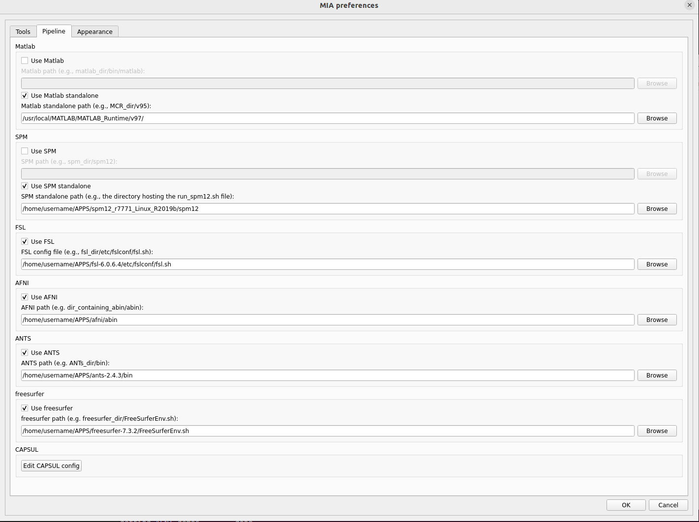

.. :orphan: is used below to try to remove the following warning: checking consistency... /home/econdami/Git_Projects/populse_mia/docs/source/documentation/preferences.rst: WARNING: document isn't included in any toctree

:orphan:

.. toctree::

+-----------------------+---------------------------------------+---------------------------------------------------+--------------------------------------------------+
|`Home <../index.html>`_|`Documentation <./documentation.html>`_|`Installation <../installation/installation.html>`_|`GitHub <https://github.com/populse/populse_mia>`_|
+-----------------------+---------------------------------------+---------------------------------------------------+--------------------------------------------------+

Populse_mia's preferences
=========================

This page is a user guide for populse_mia's preferences.

Access these preferences by going, when populse_mia is launched, to File > Mia preferences

Software presentation
---------------------

Populse_MIA's preferences are composed of three tabs:

  * :ref:`tools-label`
      * Global preferences
  * :ref:`pipeline-label`
      * Matlab and SPM configuration
  * :ref:`appearance-label`
      * Software's appearance

.. _tools-label:

Tools
-----

Global preferences
^^^^^^^^^^^^^^^^^^

  * Auto save
      * When auto save is enabled, the project is saved after each actions done in the Data Browser.

  * Clinical mode
      * When user mode is enabled, more default tags (ex. Age, Sex, Pathologie, etc.) are stored in the database and the process library is disabled (no pipeline creation).

  * Admin mode
      * Get extended rights (delete projects, processes, etc.).

  * Version 1 controller
      * Use Capsul controler version 1 (Should be soon delated)

  * Number of thumbnails in Data Browser
      * Set number of thumbnails wanted in Data Browser

  * Radiological orientation in miniviewer (data browser)
      * Use radiological orientation in MRIConv (data browser)

Projects preferences
^^^^^^^^^^^^^^^^^^^^

  * Projects folder
      * Sets the folder where the projects are stored.

  * Number of projects in "Saved projects"
      * Sets the number of the visualized projects under "Saved projects" action of the menu bar.

POPULSE third party preferences
^^^^^^^^^^^^^^^^^^^^^^^^^^^^^^^

  * Absolute path to MRIManager.jar
      * Sets the path to the executable file of MRI File Manager (usually stored in the "MRIFileManager" folder next to "populse_mia" install path, `if populse_mia was installed in user mode <../installation/user_installation.html>`_).
	 * e.g.  /home/ArthurBlair/.populse_mia/MRIFileManager/MRIManager.jar

External ressources preferences
^^^^^^^^^^^^^^^^^^^^^^^^^^^^^^^

  * Absolute path to the external resources data: some processes may require external data to function properly (as TPM.nii for SPM or template): 
    * `MiaResources <https://gricad-gitlab.univ-grenoble-alpes.fr/condamie/miaresources>`_  folder that contains the resources needeed to use populse_mia and mia_processes in some cas( ROI, templates, ect ..)
    * Sets the path to the external resources data (MiaResources)

.. _pipeline-label:

Pipeline
--------

Third-party softwares configuration. If you want to use thrid-party softwares, we nee to `install them first <../installation/3rd-party_installations.html>`_. 

Matlab
^^^^^^

  * Use Matlab
      * Enable it if you want to use Matlab (license or compiled version).

  * Matlab path
      * Sets the path to Matlab's executable
          * e.g. for linux - macOS: ``/usr/local/MATLAB/R2018a/bin/matlab``
	  * e.g. for Windows 10: ``C:/Program Files/Matlab/R2019a/bin/matlab.exe``

  * Matlab standalone path
      * Sets the path to Matlab's compiled version folder
	  * e.g. for linux - macOS: ``/usr/local/MATLAB/MATLAB_Runtime/v97/``
	  * e.g. for Windows 10: Nothing to declare here if you use spm standalone!

SPM
^^^

  * Use SPM
      * Enable it if you want to use SPM12 (license version).

  * SPM path
      * Sets the path to SPM12 folder
          * e.g. for linux - macOS: ``/usr/local/SPM/spm12``
	  * e.g. for Windows 10: ``C:/Program Files/Matlab/spm12``

  * Use SPM standalone
      * Enable it if you want to use SPM12 (standalone version).

  * SPM standalone path
      * Sets the path to SPM12 standalone folder
	  * e.g. for linux - macOS: ``/usr/local/SPM/spm12_standalone`` (folder containing run_spm12.sh)
	  * e.g. for Windows 10: ``C:/Program Files/Matlab/spm12_r7771/spm12`` (with Windows 10, it is not necessary to declare the above Matlab standalone path in this case!)

FSL
^^^

  * Use FSL
      * Enable it if you want to use FSL.

  * FSL path
      * Sets the path to the FSL config file (/fsl_directory/etc/fslconf/fsl.sh).

AFNI
^^^^

  * Use AFNI
      * Enable it if you want to use AFNI.

  * AFNI path
      * Sets the path to the AFNI abin folder (/dir_contening_abin/abin).

ANTS
^^^^

  * Use ANTS
      * Enable it if you want to use ANTS.

  * ANTS path
      * Sets the path to the ANTS bin folder (/ants_dir/bin).

freesurfer
^^^^^^^^^^

  * Use freesurfer
      * Enable it if you want to use freesurfer.

  * freesurfer path
      * Sets the path to the FreeSurferEnv.sh file (/freesurfer_dir/FreeSurferEnv.sh).

.. _appearance-label:

Appearance
----------

.. image:: ../images/preferences_3.png
   :align: center
   :name: Preferences appearance

|

  * Background color
      * Changes the Populse_MIA's background color.

  * Text color
      * Changes the Populse_MIA's text color.

  * Use full screen
      * Use full screen.

  * Main window size
      * Change main window size

