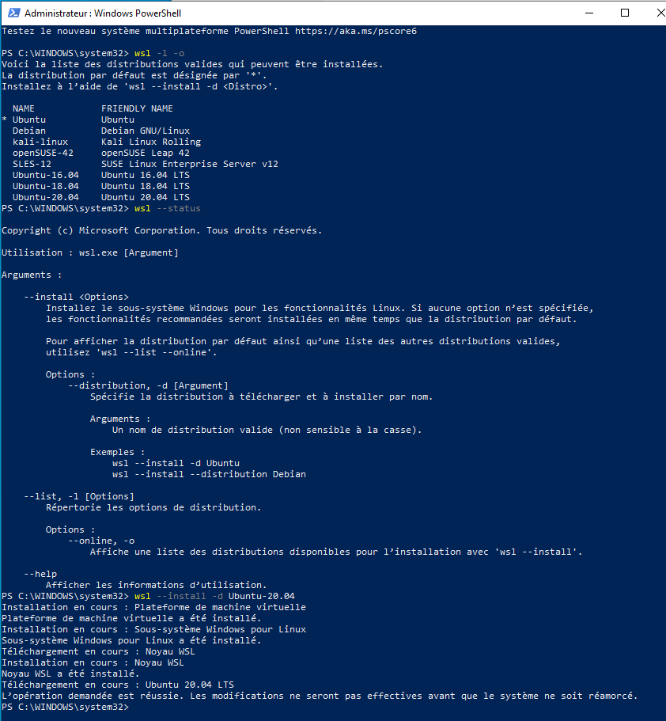
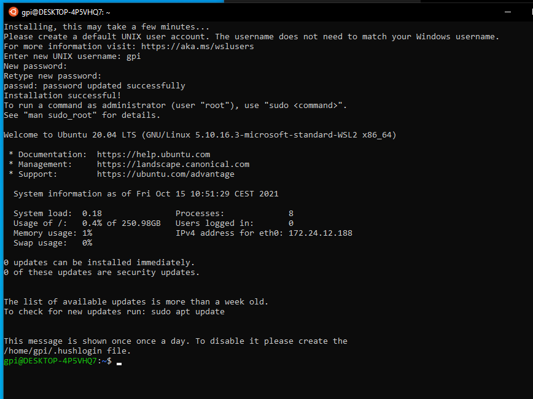

.. :orphan: is used below to try to remove the following warning: checking consistency... /home/econdami/Git_Projects/populse_mia/docs/source/installation/user_installation.rst: WARNING: document isn't included in any toctree

:orphan:

.. toctree::

+-----------------------+------------------------------------------------------+-------------------------------------+--------------------------------------------------+
|`Home <../index.html>`_|`Documentation <../documentation/documentation.html>`_|`Installation <./installation.html>`_|`GitHub <https://github.com/populse/populse_mia>`_|
+-----------------------+------------------------------------------------------+-------------------------------------+--------------------------------------------------+

Pre-requirements of windows installations are the same for `windows host installation in user mode <https://populse.github.io/populse_mia/html/installation/host_pre_req_windows10.html>`_. But you can avoid numpy and PyQt5 install commands since they will be managed while installing the mia project in on ubuntu.

Once pre-requirements are acquired, you will need to install Wsl2 to host a virtual machine of ubuntu to install mia.

1- WSL2 (Windows Subsystem Linux) installation
-------------------------------------------

* In an administrator type Windows account:
      - Windows 10 must be up to date
      - You need to have enough free space on your system disk : around 20 Gb
      - Open a **PowerShell as administrator** (right clic on powershell icon
enter: ::

  wsl --install -d Ubuntu-20.04

|

|

* Reboot the computer

* Normally a linux ubuntu window is already available, enter it:

- enter a user / password who will be administrator of this linux (asked by the system)

|

then you can write your first commands to make ubuntu up to date: ::

   sudo apt update

   #at this first sudo command, the system may ask you to enter the password you just enter before.

   sudo apt upgrade -y

   exit
|

- close this window

Now you have WSL2 and an Ubuntu 20.04 linux.

Before you install a new distribution using ``wsl --install -d distribution``, make sure that WSL is in 2 mode with:  
   ``wsl --set-default-version 2``
The distribution is only available for the current Windows user.  
Usefull : in the Ubuntu WSL Windows terminal, we can access Windows files via ``/mnt/c/``  

To know more:  
   - [Manual installation steps for older versions of WSL](https://docs.microsoft.com/en-us/windows/wsl/install-manual)
   - [Install WSL](https://docs.microsoft.com/en-us/windows/wsl/install)
   - [Basic commands for WSL](https://docs.microsoft.com/en-us/windows/wsl/basic-commands)

2- Upgrade Ubuntu 20.04 to 22.04 (Only for devellopers )
--------------------------------------------------------
|

If you are a developper, you will need Ubuntu 22.04 to work on the whole project populse.
If not , you can ignore this part 2.
You have precedently update the linux system. You can directly upgrade your linux Ubuntu distriution to 22.04 with the following commands:

To get if any new release is available type: ::

  sudo apt dist-upgrade

|

* Install the update manager:

Although the update manager core will already be there, however, to confirm just run the given command: ::

  sudo apt install update-manager-core

|
	
Edit release-upgrades configuration file using the below-given command: ::

  sudo nano /etc/update-manager/release-upgrades

|

After that change the Prompt value from Normal to LTS. However, by default it will be set to LTS: ::

  Prompt = lts

|
	
Save the file by pressing Ctrl+O and then exit the same with Ctrl+X.

Here startes the concrete upgrade by the command: ::

  sudo do-release-upgrade -d

|

After running the above command, the system will update and replace the system repository and after that, once the system is ready to get upgraded, you will ask finally whether you want to upgrade or not. If you have changed your mind then type ‘n‘ and the system will roll back all the made changes.

Once the installation of the new Jammy Jelly Fish is completed, remove the obsolete packages to clear some space by pressing Y and hitting the Enter key.

The WSL Ubuntu App will ask you to restart the system. However, it has not been started as an init system, so that will not be possible. Therefore, simply close the WSL app window and open it again.

You can chechk the Ubuntu version installed via the command: ::

  cat /otc/os-release

|

3- X server installation in windows with VcXsrv
-----------------------------------------------
|

We also need a X windows server to allow linux applications graphic user interface (GUI) works.  

Get `[VcXsrv](https://sourceforge.net/projects/vcxsrv/files/latest/download)
  - Execute it, 
  - click 'next' then 'install' to install it 

Looking for XLaunch application icon, launch it

Configure it like the screenshots below:
  
   .. image:: ../../../developer_doc/images/screenshots/Xlaunch_1.png
      :align: center
      :name: Xlaunch_1

|

   .. image:: ../../../developer_doc/images/screenshots/Xlaunch_2.png
      :align: center
      :name: Xlaunch_2

|

Disable *'Native opengl'*
Enable *'Disable access control'*
     
   .. image:: ../../../developer_doc/images/screenshots/Xlaunch_3.png
      :align: center
      :name: Xlaunch_3

|

Do *'Save Configuration'* in a file that allow you to launch it later (ie on the Desktop)

   .. image:: ../../../developer_doc//images/screenshots/Xlaunch_4.png
      :align: center
      :name: Xlaunch_4

|

Allow access asked by Windows firewall
 
 P.S: You have to make sure VcXsrv is running every time you to run a GUI via your Ubuntu linux distribution.
  
4 - Dependencies Installation
-----------------------------
|

Open an Ubuntu session in Windows by:

- click on Ubuntu new icon

  or

- open a normal Windows PowerShell,enter ``ubuntu.20.04.exe``

In this Ubuntu window terminal, install the following dependencies: ::

   sudo apt install -y build-essential uuid-dev libgpgme-dev squashfs-tools libseccomp-dev wget pkg-config git git-lfs cryptsetup-bin python3-distutils python3-dev
   # Ubuntu 20.04
   sudo apt install python-is-python3
   # Ubuntu 18.04
   sudo ln -s python3 /usr/bin/python

|

You have completely installed a virtual Ubuntu which now is able to host. You can now follow steps for `populse mia installation in user mode <https://populse.github.io/populse_mia/html/installation/virtualisation_user_installation.html>`_.

